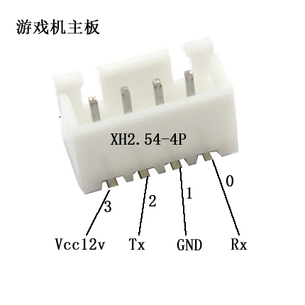
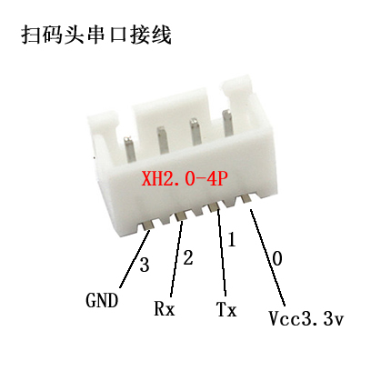

# 游戏机通用扩展协议
## 一 说明
本文档定义出游戏机与周边设备互动的通讯协议，包括如下用途：
- 游戏机与卡系统进行支付与数据采集
- 游戏机与投币器进行投币防干扰
- 游戏机与数据采集设备进行数据交换与监控
## 二 摘要
游戏机行业有史以来一致没有一份受大家公认的协议，虽存在两两厂商互通。但存在不通用不完善的缺点。导致浪费各方资源。此协议定义的主要目的如下：
- 统一游戏机周边对接设备的协议，减少行业资源浪费
- 使用协议通讯放弃脉冲通讯，提高游戏机安全性（防止干扰器）
- 实现游戏机与各设备即插即用，减去安装调试步骤
- 实现游戏机信息采集与控制
## 三 协议线路愿景
- V1.0 覆盖主流的模拟机，彩票机，礼品机与周边设备的通讯协议
- V1.1 召集各厂商（20家）加入实现此协议并邀请各厂商技术工程师加入维护团队，有意加入维护的行业技术人员可通过自行Fork代码提交自己的更新。或者微信联系17702043650杨生进行接口优化探讨。
- V1.5 协议已完善并初步稳定，并倡导厂商贡献出实现接口的代码
- V2.0 生产出协议调试设备方便调试使用
## 四 历史版本

版本|日期|修改者|内容
---|---|---|---
V0.8|20180509|wangjianyi|初稿
V0.9|20180601|Benny|加入礼品机投币含中奖结果
V1.0|20180709|Benny|加入彩票机游戏结束过程

## 五 名词解释
- 模拟机:游戏过程中只投币无任何奖励的游戏设备
- 彩票机:游戏过程以彩票为主要奖励方式的游戏设备
- 礼品机:游戏过程以实物礼品为主要奖励方式的游戏设备
- 实物币：传统场所用钱购买的的实际能拿在手里的一枚一枚代币
- 电子币：保存在某媒介的，不能实际拿到手上的虚拟代币
- 抓力:娃娃机在游戏某个阶段给予爪子的力度
- 卡头:通常安装在游戏机表面，带明显的显示装置，解决会员刷卡或线上支付的设备
- 支付盒子:通常安装在游戏机内部，作为游戏机扩展功能实现游戏的支付的设备
- 正扫：游戏机为了方便支付，将固定二维码贴在机器上。客户扫码都经过指引进行支付的一种支付形式
- 会员反扫：会员在手机出示虚拟会员卡的二维码，进行代币支付的一种支付形式
- 付款吗反扫：会员在手机出示微信或支付宝付款吗，被游戏机扫描后进行支付的一种支付形式
- 扫码头：单纯实现将二维码或条码扫描到后将结果通过接口传递出去的设备，一般内嵌到设备中
- 事务ID：用于防止重发与漏发用的一个循环使用的ID，游戏机与外接设备自行维护每次使用后加一，溢出归零后继续循环，如接收到的事务ID与上次相同，视为已经处理过，回应成功。如果收到的事务ID不等于上次收到的事务ID表示需要进行处理和回应并将最新的ID记录起来。
- 厂商标识：标记各生产厂商的序列
- 厂商产品：厂商出厂的某型号产品

## 六 电器物理特性

###  6.1 游戏机主板上固定接口定义（待完善）

使用XH2.54-4P封装插座如下图：

针脚定义如下：

脚位|定义|作用
---|---|---
0|Rx|串口接收TTL3.3v，建议对接的设备（盒子等）使用二极管隔离以防不慎将线插反导致损坏
1|GND|共地
2|Tx|串口发送TTL3.3v
3|Vcc|给对接的设备（盒子等）供电12v

串口通讯规则如下：
- 电平：TTL3.3v
- 波特率：115200
- 起始位：1位
- 数据位：8位
- 奇偶校验位：无
- 停止位：1位

### 6.2 游戏机内置扫码头接口定义（待完善）

使用XH2.0-4P封装插座如下图：

扫码头传输协议使用字节将内容使用AscII码进行编码传输，针脚定义如下：
脚位|定义|作用
---|---|---
0|GND|共地
1|Rx|串口接收TTL3.3v
2|Tx|串口发送TTL3.3v
3|Vcc|给对接的设备（盒子等）供电12v

## 七 数据包基础规则
###  7.1 所有数据通讯包包含如下元素:
名称|符号|长度|说明
---|---|---|---
包头|START|2字节|固定为0xEF37
地址|ADR|2字节|P位或设备地址,于用适应一个设备多个P位问题，默认为0
命令码|PID|2字节|指令码，用于判断DATA段的内容
内容长度|LEN|2字节|DATA段的数据长度
内容|DATA|N字节|命令的详细参数内容
校验|CHK|2字节|第一字节等于之前所有字节相加自动溢出既sum(START,...,DATA),第二字节等于之前所有字节异或既Xor(START,...,DATA)
包尾|END|2字节|固定为0XFE73

举例握手协议命令如下(Hex)：

START|ADR|PID|LEN|DATA|CHK|END
---|---|---|---|---|---|---
55AA|0001|0301|001F|00000001 00000001 FA00FCCDA57D8990FA00FCCDA57D8990 0101|B29C|AA55

###  7.2 字节数组与数字转换

数据中如有多字节转换为数字时，高位在前，如 0x1234=0x12*256+0x34

###  7.3 基本原理

游戏机启动时，给外接设备供电。外接设备发送握手指令给游戏机，游戏机告知外接设备设备的厂商，使用的本协议的版本，和产品型号信息。外接设备根据接口版本自行兼容新旧协议版本。

## 八 命令详细

### **8.1 握手(PID=0x0301)**

版本:1

数据方向:外接设备->游戏机

说明：外接设备搜索游戏机，此时如果如果收不到游戏机的回应将会间隔500ms进行搜索，推荐如果1分钟内仍然搜索不到则每3秒一次进行搜索，直到连接成功。否则当离线处理

外接设备发送内容（DATA）如下:

发送参数|长度|说明
---|---|---
厂商标识|4Byte|外接设备的厂商标识，第九章名录
产品标识|4Byte|产品编号，第九章名录
设备唯一ID|16Byte|相对厂商和产品唯一ID
设备类型|2Byte|0x0101=卡头,0x0102=投币器,0x0103=支付盒子

游戏机回应PID=0x0381内容如下:

应答参数|长度|说明
---|---|---
协议版本|4Byte|当前使用的本协议版本如：1，需要外接设备根据次数来适配不同版本的协议
厂商标识|4Byte|游戏机厂商标识，第九章名录
产品标识|4Byte|产品编号，第九章名录
设备唯一ID|16Byte|相对厂商和产品唯一ID
P位数|1Byte|此接口控制的P位数
设备类型|2Byte|0x0001=模拟机,0x0002=彩票机,0x0003=礼品机

举例：待完善

### **8.2 状态同步(PID=0x0302)**

版本:1

数据方向:外接设备->游戏机

说明：用于外接设备与游戏机进行状态同步，外接设备在空闲时每隔10秒发一次同步, 游戏中每隔1秒

外接设备发送内容（DATA）如下:

发送参数|长度|说明
---|---|---
设备状态|1Byte|0x00=正常，0x01=故障
故障码|2Byte|详见第十章故障码

游戏机回应（PID=0x0382）内容如下:

应答参数|长度|说明
---|---|---
游戏机状态|1Byte|0x00=游戏机启动中,0x01=待机状态,0x02=有币待开始,0x03=游戏中,0x04=游戏结束(3秒后转为待机或有币待开始)，0x05=进入了设置模式，0x06=故障中
剩余游戏币数|2Byte|游戏机内剩余未使用币数	
预计游戏结束时间|2Byte|单位为秒，状态为游戏中有效
故障码|2Byte|故障中状态有效，详见第十章故障码

举例：待完善

### **8.3 投币(PID=0x0303)**

版本:1

数据方向:外接设备->游戏机

说明：此场景用于，外接设备进行云支付或者投币器进行投币时使用，当用于礼品机时表示此次投币使用游戏机内置单机概率进行出奖,将以每200ms一次的频率一直发送5秒直到有回应，如5秒未回应代表离线将按超时来处理。支付设备将进行退款处理。

外接设备发送内容（DATA）如下:

发送参数|长度|说明
---|---|---
事务ID|2Byte|用于标识一次投币行为的防重发与防漏发
投币数|2Byte|投币数量
币类型|1Byte|0=云支付,1=实物币

游戏机回应PID=0x0383内容如下:

应答参数|长度|说明
---|---|---
此次事务ID|2Byte|复制发送的事务ID
支付结果|2Byte|0x0000=成功,其他=错误码，详见第十章故障码

举例：待完善

### **8.4 带中奖信息投币(PID=0x0304)**

版本:1

数据方向:外接设备->游戏机

说明：此场景用于礼品机支付时云端服务对其进行概率干预时使用，超时处理同8.2

外接设备发送内容（DATA）如下:

发送参数|长度|说明
---|---|---
事务ID|2Byte|同上
游戏局数|2Byte|此处非游戏币数，是游戏能开始的次数
中奖序列|游戏局数*1Byte|0x00=不出奖,0x01=出奖,此次增加局数按此序列进行出奖

游戏机回应PID=0x0384内容如下:

应答参数|长度|说明
---|---|---
此次事务ID|2Byte|复制发送的事务ID
支付结果|2Byte|0x0000=成功,其他=错误码，详见第十章故障码

举例：待完善

### **8.5 通用参数设置(PID=0x0305)**

版本:1

数据方向:外接设备->游戏机

说明：用于远程设置游戏机参数，将模拟机参数设置到机器中，超时时间2秒

外接设备发送内容（DATA）如下:

发送参数|长度|说明
---|---|---
每局币数|1Byte|0~255（枚）
游戏时间|1Byte|1~255（秒）

游戏机回应PID=0x0385内容如下:

应答参数|长度|说明
---|---|---
设置结果|2Byte|0x0000=成功,其他=错误码，详见第十章故障码

举例：待完善

### **8.6 恢复出厂参数设置(PID=0x0306)**

版本:1

数据方向:外接设备->游戏机

说明：用于远程设置游戏机参数，将游戏机设置还原成出厂默认参数，超时时间2秒

外接设备发送内容（DATA）如下:

发送参数|长度|说明
---|---|---
无| | 

游戏机回应PID=0x0386内容如下:

应答参数|长度|说明
---|---|---
设置结果|2Byte|0x0000=成功,其他=错误码，详见第十章故障码

举例：待完善

### **8.7 设置娃娃机参数(PID=0x0307)**

版本:1

数据方向:外接设备->游戏机

说明：用于远程设置礼品机参数，其中强爪力度一般会给100，如果非100是为了让强爪和弱爪不那么明显的差距。弱爪力度一般是根据娃娃的重量来估算力度的。如果需要对力度进行精准的第一，第二，第三爪力进行调节，请在机器上进行手动调节后，娃娃机根据弱爪力度整体控制。如需解决复杂爪力设置后复制到其他设备问题，请使用8.8章的扩展参数进行读取和设置进行复制。

外接设备发送内容（DATA）如下:

发送参数|长度|说明
---|---|---
每局币数|1Byte|0~255（枚）
游戏时间|1Byte|1~255（秒）
弱爪力度|1Byte|1~100 (百分比)
强爪力度|1Byte|1~100 (百分比)
单机中奖率设置|2Byte|0~0xFFFF几币出礼品，用于在非服务端进行概率干预时游戏机自行处理中奖判断

游戏机回应PID=0x0387内容如下:

应答参数|长度|说明
---|---|---
结果|2Byte|0x0000=成功,其他=错误码，详见第十章故障码

举例：待完善

### **8.8 设置娃娃机参数(PID=0x0308)**

版本:1

数据方向:外接设备->游戏机

说明：用于远程设置礼品机参数，其中强爪力度一般会给100，如果非100是为了让强爪和弱爪不那么明显的差距。弱爪力度一般是根据娃娃的重量来估算力度的。如果需要对力度进行精准的第一，第二，第三爪力进行调节，请在机器上进行手动调节后，娃娃机根据弱爪力度整体控制。如需解决复杂爪力设置后复制到其他设备问题，请使用8.8章的扩展参数进行读取和设置进行复制。

外接设备发送内容（DATA）如下:

发送参数|长度|说明
---|---|---
每局币数|1Byte|0~255（枚）
游戏时间|1Byte|1~255（秒）
弱爪力度|1Byte|1~100 (百分比)
强爪力度|1Byte|1~100 (百分比)
单机中奖率设置|2Byte|0~0xFFFF几币出礼品，用于在非服务端进行概率干预时游戏机自行处理中奖判断

游戏机回应PID=0x0387内容如下:

应答参数|长度|说明
---|---|---
结果|2Byte|0x0000=成功,其他=错误码，详见第十章故障码

举例：待完善

## 九 厂商以及产品名录
厂商|厂商编号|产品|产品编号|设备类型|说明|照片
---|---|---|---|---|---|---
油菜花|00001|果冻卡头V2|0001|卡头|外装于游戏机表面实现刷卡，正扫支付，数据采集的设备|链接
油菜花|00001|芸苔盒子V2|0002|支付盒子|内置于游戏机机内实现正扫支付，反扫支付，数据采集的设备|链接
油菜花|00001|反扫卡头V2|0003|支付盒子|外装于游戏机表面实现正扫支付，反扫支付，数据采集的设备|链接
华熙动漫|00002|两爪机|0001|支付盒子|娃娃机|链接
谷微动漫|00003|xx机|0001|支付盒子|娃娃机|链接

## 十 故障码

游戏机故障码

代码|说明
---|---
0x0101|xccccc